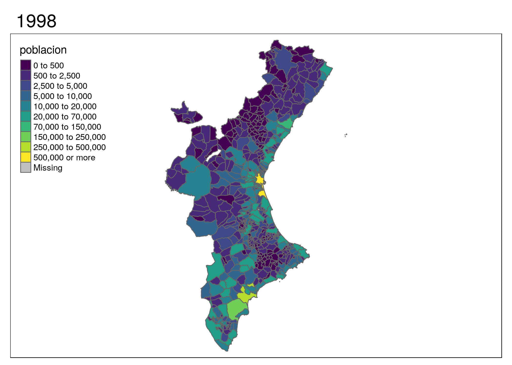

```{r setup, include=FALSE}

knitr::opts_chunk$set(echo = TRUE)
```

Realizarmos la carga de los paquetes que nos harán falta a lo largo de la tarrea a realizar.


```{r,message=FALSE}

library(ggmap)
library(rgdal)
library(rgeos)
library(maptools)
library(dplyr)
library(tidyr)
library(tmap)
library(geospatial) # Instalado en los programas del día 
library(sp)
library(maps)
library(raster)
library(tmaptools)
library(leaflet)
library(stringr)
library(readxl)
library(dplyr)
library(gdata)
library(tidyr)
```

#1. Descarga y acondiciona los datos de población de las tres provincias de la Comunidad
Valenciana, por municipios, de la página web del Instituto Nacional de Estadística Padrón
municipal así obtendrás los valores del padrón municipal durante los últimos años (2 puntos)


Leemos los datoes y cambiamos los nombres de las columnas, ya que se importan de una forma que no se desea

```{r,message=FALSE}
Datos_Castellon <- data.frame(read_excel("datos/Datos_Castellon.xls"))
Datos_Valencia <- data.frame(read_excel("datos/Datos_Valencia.xls"))
Datos_Alicante <-  data.frame(read_excel("datos/Datos_Alicante.xls"))
total <- rbind(Datos_Alicante,Datos_Castellon,Datos_Valencia) 
names(total) <- c("Poblacion",seq(2018,1996,-1))
total <- total[,1:24]
total <- total[,-23]
total$Poblacion <- str_extract(total[,1],"(?=)[^0-9]+")
total$Poblacion <- str_trim(total$Poblacion,side = 'left')
rm(Datos_Alicante,Datos_Castellon,Datos_Valencia)
```


Seleccionamos de las poblaciones unicamente el nombre, para ello hacemos uso de expresiones regulares. Y lo sustituimos en los dataFrames.

Separamos ahora en los que tienen la barra para seleccionar solo aquellos que esten en castellano.


```{r}

nombreAll_var <- str_subset(total$Poblacion,"/")
indice_nombres <- c()
#primero me guardo los indices de los valores que voy a sustituir mas adelante, una vez arregle los nombres.
for (i in seq(1,length(nombreAll_var),1)){
  
  indice_nombres[i] <- which(total$Poblacion==nombreAll_var[i])

}

# Despues los separamos por castellano y valenciano, nos quedaremos con los nombres en casetllano.Para ello hacemos uso de de barra separadora entre los nombers para separarlos.

nombreAll<- str_split(nombreAll_var,'/') 

numerosCast <- c(1,1,1,1,1,2,1,1,1,1,2,1,1,1,2,1,2,1,1,1,2,1,2,2,1,1,1,2,1,2,2,1,1,2)
nombreAll_bien <- c()
for (i in seq(1,length(nombreAll),1)){
  
  nombreAll_bien[i] <- nombreAll[[i]][numerosCast[i]]

}

#finalmente los metemos de muevo al dataframe origen.

for (i in seq(1,length(nombreAll),1)){
  
  total$Poblacion[indice_nombres[i]] <- nombreAll_bien[i]

}

```


Ahora vamos a realizar lo mismo para pasar los articulos que estan detras del nombre del pueblo antes del mismo.
```{r}

nombreAll_coma <- str_subset(total$Poblacion,",")
indice_nombres_comas <- c()
#primero me guardo los indices de los valores que voy a sustituir mas adelante, una vez arregle los nombres.
for (i in seq(1,length(nombreAll_coma),1)){
  
  indice_nombres_comas[i] <- which(total$Poblacion==nombreAll_coma[i])

}

nombreAll_coma<- str_split(nombreAll_coma,',') 

numeroscoma1 <- rep(1,length(nombreAll_coma))
numeroscoma2 <- rep(2,length(nombreAll_coma))
nombreAll_coma1 <- c()
nombreAll_coma2 <- c()
nombre<- c()
for (i in seq(1,length(numeroscoma1),1)){
  
  nombreAll_coma1[i] <- nombreAll_coma[[i]][numeroscoma1[i]]
  nombreAll_coma2[i] <- nombreAll_coma[[i]][numeroscoma2[i]]
  nombreAll_coma2<- c( "L'"  ,"L'"  ,"L' "  ,"El " , "El " , "Los ", "La ",  "Els ","El "  ,"La "  ,"La "  ,"La "  ,"La "  ,"El " , "L'","Les ","La "  ,"La "  ,"La "  ,"La "  ,"La "  ,"La " , "La " , "El " ,"La "  ,"La "  ,"La "  ,"La "  ,"L'"  ,"L'" , "L'" , "L'" ,"L'"  ,"La "  ,"La "  ,"La "  ,"La "  ,"L'"  ,"El "  ,"La " ,"La " , "La "  ,"La "  ,"El "  ,"El "  ,"La ")
  nombre[i] <- str_glue(nombreAll_coma2[i],nombreAll_coma1[i])
}

#finalmente los metemos de muevo al dataframe origen.

for (i in seq(1,length(nombre),1)){
  
  total$Poblacion[indice_nombres_comas[i]] <- nombre[i]

}
```
#2. Descarga un mapa de la Comunidad Valenciana por municipios y añade la información descargada del padrón municipal. 

Sacamos la info de los municipios de España y nos quedamos unicamente con aquellos que pertenecen a Alicante, Castellón y Valencia.

```{r}
SpainRegions_mun <- getData('GADM', country='ESP', level=4)
SpainRegions_mun_Ali <- SpainRegions_mun[SpainRegions_mun@data$NAME_2=='Alicante',]
SpainRegions_mun_Cas <- SpainRegions_mun[SpainRegions_mun@data$NAME_2=='Castellón',]
SpainRegions_mun_Val <- SpainRegions_mun[SpainRegions_mun@data$NAME_2=='Valencia',]
  

total_SpainRegions_muni <- rbind(SpainRegions_mun_Ali,SpainRegions_mun_Cas,SpainRegions_mun_Val) 
total_SpainRegions_muni<- total_SpainRegions_muni[!duplicated(total_SpainRegions_muni@data$NAME_4),] #eliminamos aquellos valores duplicados .


```


Como algunos de los datos difieren entre los obtenidos del INE y los de la funcion getMap, debemos acondicionarlos para luego poder juntas ambos conjusntos de datos.

```{r}
indices_dist <- which(!total$Poblacion%in%total_SpainRegions_muni$NAME_4) # con esto sacamos los indices de aquellos que son distintos de total y total_spainregions.

nombreCAMBIO<- c("Adsubia","Binigembla","Callosa d'En Sarrià","Calpe" ,"Tárbena","Vall de Ebo","Jalón","Almazora","Ares del Maestre","Benasal","Sant Jordi","Sarratella" ,"Torre Endoménech","Les Useras","Villarreal","Vistabella del Maestrazgo","Chert","Alfara de Algimia","Alquería de la Condesa","Benigánim","Benisanó" ,"Benisuera","Guadasequies" ,"Lugar Nuevo de la Corona","Masalavés","Monserrat","Potríes" ,"Puig","Rafelbuñol","Real de Montroi","Real de Gandía","San Juan de Énova" ,"Valencia" )
 
 for (i in seq(1,length(nombreCAMBIO),1)){
  
  total$Poblacion[indices_dist[i]] <- nombreCAMBIO[i]

}
 
#limpiamos las variables intermedias que hemos usado para acondicionar los datos.
rm(i,indice_nombres,indice_nombres_comas,indices_dist,nombre,nombreAll,nombreAll_coma,nombreAll_coma1,nombreAll_coma2,numerosCast,numeroscoma1,numeroscoma2,nombreAll_var,nombreCAMBIO,SpainRegions_mun_Ali,SpainRegions_mun_Cas,SpainRegions_mun_Val,nombreAll_bien,SpainRegions_mun)
```
Eliminamos los valores repetidos del dataframe de los mapas sacada de la funcion getMap, los cuales seran Alicante, Valencia, Xativa y Domeño.


Vamos ahora a añadir los datos limpios del INE a los datos obtenidos mediante la funcion getMap, con el fin de realizar la representacion que se nos pide de la evolución de la poblacion en la Comunidad Valenciana.

```{r}
SpainRegPoblacion<-sp::merge(total_SpainRegions_muni,total,by.x="NAME_4",by.y="Poblacion")
```

#Visualiza un mapa de la Comunidad que muestre la evolución de la población, por municipios. Dibuja un mapa por año.

Realizamos la representación de los mapas para cada uno de los años.


```{r, message=FALSE,warning=FALSE}
library(colorspace)
library(mapview)
tmap_mode("view")
breaks <- c(0, 500, 2500, 5000, 10000, 20000, 70000, 150000, 250000, 500000, Inf)
numero <- seq(1998,2018,1)

for ( i in numero){
   mapa<-tm_shape(SpainRegPoblacion)+tm_fill(paste(i),style = "fixed", breaks = breaks,palette = "viridis", n = 20)+tm_layout("Poblacion",legend.outside=T,legend.position = c("left","top")) +tm_borders( lwd = 1, lty = "solid", alpha = 0.5)

   print(mapa)
    
}


```

#4.Muestre la evolución de la población en forma de animación en una misma gráfica.

Una vez realizado los mapas procedemos a la creación del GIF de la evolución de la población de la Comunidad Valenciana a lo largo del intervalo de años del cual disponemos. Para ello primero deberemos juntar los datos por años, para poder realizar el gráfico deseado.

```{r}
#devtools::install_github('talgalili/installr')
library(installr)
library(animation)
library(magick)
library(sp)
library(dplyr)
SpainRegPoblacion_copia <- SpainRegPoblacion

SpainRegPoblacion@data<- SpainRegPoblacion@data %>%  gather(year, poblacion,'2018':'1998') # Realizamos un gather por los años.

tmap_mode("plot")
GIF_CV <- tm_shape(SpainRegPoblacion)+tm_fill('poblacion',style = "fixed", breaks = breaks,palette = "viridis", n = 20)+tm_layout(
          legend.position = c("left","top")) +  tm_facets(along = "year", free.coords = FALSE) + tm_borders()

#tmap_animation(GIF_CV, filename = "GIF_CV.gif", delay = 80) #Lo dejo comentado, ya que no deseo crear el gif de nuevo
```




Eliminamos todas las variables intermedias y guardamos los datos en ficheros de tipo Rdata.
```{r}
rm(mapa,total,total_SpainRegions_muni,i)
# Lo dejo comentado ya que no quiero guardarlo de nuevo, si se tienen una vez no es necesario guardarlo de nuevo.
#save(SpainRegPoblacion, file = "data_GIF.RData") 
#save(SpainRegPoblacion_copia, file = "data_original.RData")
```

#5. Integrar la aplicación en un Shiny para que el usuario pueda elegir la provincia a representar.


```{r}

library(shiny)
library(leaflet)
library(tmap)
load(file='data_original.RData')

varlist <-unique(SpainRegPoblacion_copia@data$NAME_2)

runApp(list(
  ui =  fluidPage(
    titlePanel("Poblaciones por comunidad"),
    sidebarLayout(
      sidebarPanel(
        selectInput("comu", label = "Comunidad", choices = varlist),
        selectInput("anyo", label = "Año", choices = numero)
      ),
      mainPanel(
        leafletOutput("mapa_comu_anyo")
      )
    )
  ),
  server = function(input, output) {
    
    
    output$mapa_comu_anyo <- renderLeaflet({
      mapita <- tm_shape(SpainRegPoblacion_copia[SpainRegPoblacion_copia@data$NAME_2 == input$comu,])+
        tm_fill(col = input$anyo,
                style = "fixed", 
                breaks = breaks ,palette="viridis")+
        tm_borders(alpha =  0.7)+
        tm_layout(main.title = paste("Comunidad Valenciana", input$anyo),
                  title.size = 2,legend.outside = T,
                  legend.outside.position = c("left","top"))+tm_polygons(input$comu)
      mapitaleaf <- tmap_leaflet(mapita)
      mapitaleaf
      
    })
    
  }
))

```


#Anexo

No compilo el archivo a HTML, ya que al incluir el shiny app, no termina de ejecutar el proceso de knitr.
Así mismo, si se realiza la compilacion con los graficos del mapa por años con el modo tmap_mode("view"), en el knitr( sin incluir el shiny app, no me muestras nungún gráfico), no obstante poniendo el modo tmap_mode("plot"), si que compila en el knitr las graficas de forma adecuada.

Finalmente, si ponemos el modo tmap_mode("plot")por alguna razon que escapa de toda logica, el bucle funciona de forma correcta, pero las imagenes de los mapas aparecen desordenadas.


